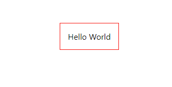

# RJR - React JSON Renderer

React Component for rendering DOM elements and components from JSON.

Features a 'modifier' system for altering component props and conditionally wrapping components to add functionality without modifiying component code.

## Install

```bash
yarn add rjr-core
```

## Table of Contents

1. [Basic Usage](#basic-usage)
2. [JSON Schema](#json-schema)
3. [API](#api)
4. [Modifiers](#modifiers)
5. [modifierConfigs](#modifierConfigs)
6. [useGetModifierConfig Hook](#useGetModifierConfig-hook)
7. [Reserved PRop Names](#reserved-prop-names)
8. [elements prop](#elements-prop)
9. [Special functionality for Forms](#special-functionality-for-forms)

## Basic Usage

[CODESANDBOX](https://codesandbox.io/s/basic-usage-h1hwz)

Component (DisplayContents.js)

```javascript
import React from 'react';

const DisplayContents = (props) => <div {...props}>{props.contents}</div>;

export default DisplayContents;
```

Component Map (componentMap.js)

```javascript
import DisplayContents from './DisplayContents';

export default { DisplayContents };
```

JSON (config.json)

```json
{
  "elements": [
    {
      "component": "div",
      "properties": {
        "className": "container"
      },
      "children": [
        {
          "component": "DisplayContents",
          "properties": {
            "contents": "Hello World",
            "style": {
              "padding": 15,
              "border": "1px solid red"
            }
          }
        }
      ]
    }
  ]
}
```

Renderer (App.js)

```javascript
import React from 'react';

import RJR from 'rjr-core';

import componentMap from './componentMap';

import config from './config.json';

const App = () => {
  return <RJR config={config} componentMap={componentMap} />;
};
```

Result



---

## JSON Schema

```JSON
{
  "$schema": "http://json-schema.org/draft-07/schema#",

  "definitions": {
    "element": {
      "type": "object",
      "properties": {
        "component": { "type": "string" },
        "properties": {
          "type": "object",
          "properties": {
            "elements": {
              "type": ["array", "string"],
              "contains": { "$ref": "#/definitions/element" }
            },
            "additionalProperties": true
          },
          "additionalProperties": true
        },
        "wrapper": { "type": "string" },
        "children": {
          "type": ["array", "string"],
          "contains": { "$ref": "#/definitions/element" },
          "default": []
        }
      }
    }
  },

  "type": "object",

  "properties": {
    "elements": {
      "type": "array",
      "contains": { "$ref": "#/definitions/element" }
    },
    "partials": {
      "type": "object",
      "additionalProperties": {
        "type": "array",
        "contains": { "$ref": "#/definitions/element" }
      }
    }
  }
}

```

The JSON passed to RJR via the 'config' prop should be an object with the following properties:

- **elements** _array_ - An array of element objects _required_
  - Each element object can have the following properties:
    - **component** _string_ - either a lower case string for a dom element ('div') or an uppercase string for a component (that exists in the 'componentMap' passed to RJR) _required_
    - **properties** _object_ - The default properties passed to the element or component
    - **children** _array or string_ - Either an array of elements following the same structure as the top level **elements** array, or a string (text node)
- **partials** _object_ - An object where each property is an array of **elements**. String values passed to the **children** property of element objects are checked to see if they match any of the keys in **partials**, and if so are replaced with the partial's elements. Multiple partials can be specified using | as a separator.

Example:

```JSON
{
  "partials": {
    "inputPartial": [
      {
        "component": "input",
        "properties": {
          "name": "myinput",
          "type": "text"
        }
      }
    ],
    "checkboxPartial": [
      {
        "component":"input",
        "properties":{
          "name":"mycheckbox",
          "type":"checkbox"
        }
      }
    ]
  },
  "elements": [
    {
      "component": "div",
      "children": "inputPartial|checkboxPartial"
    }
  ]
}
```

Is converted into this object by RJR:

```javascript
{
  elements: [
    {
      component: 'div',
      children: [
        {
          component: 'input',
          properties: {
            name: 'myinput',
            type: 'text',
          },
        },
        {
          component: 'input',
          properties: {
            name: 'mycheckbox',
            type: 'checkbox',
          },
        },
      ],
    },
  ];
}
```

---

## API

### **config**

JSON object with elements and optional partials to be rendered

### **componentMap**

Object mapping string keys to components

```javascript
const MySimpleComponent = (props) => <div>A very simple component</div>;

const componentMap = { MySimpleComponent };

const config = {
    elements: [
        {
            component:"MySimpleComponent"
        }
    ]
}

const App = () => {
    return <RJR config={config} componentMap={componentMap}>
}

// Displays 'A very simple component'
```

### **componentProps**

Object where keys identify components and values are either an object (which is merged into existing props) or a function that recieves props as an argument and returns an object, overwriting whatever props were specified for the component in the JSON config.

Keys, in order or precedence, can be either:

1. The value for 'elementId' property, provided to the component as prop in the config JSON.
2. The value for 'name' property, for form elements
3. The name of a component (as it appears in the componentMap). This will apply the prop modification to all instances of that component

```javascript
const SomeComponent = (props) => <div>{props.content}</div>;
const InputComponent = (props) => <input type="number" {...props} ></input>;

const componentMap = { SomeComponent, InputComponent };

const config = {
    elements: [
        {
            component:"SomeComponent"
        },
        {
            component:"SomeComponent"
            properties:{
                elementId:"identifier"
            }
        },
        {
            component:"InputComponent",
            properties:{
                 name:"myInput",
                 num:5
            }
        }
    ]
}

const App = () => {
    return <RJR config={config} componentMap={componentMap} componentProps={{
        SomeComponent: {
            content: "default content"
        },
        identifier: {
            content:"special content"
        },
        myInput: function(props){
            return {
                ...props,
                defaultValue: props.num + 5
            }
        }
    }} />
}

//The first component displays 'default content', the second displays 'special content', and the third shows an input element with the value '10'

```

### modifiers

Provides the ability to make modifications to props and conditonally wrap components during the rendering loop. See the 'Modifiers' section for details

### modifierConfigs

See the 'modifierConfigs' section for details

---

## Modifiers

Modifiers come in three flavors:

1. **rendererProps** - modifies component props during the rendering loop. Has access to the props of the component's parent, so it can implement prop drilling.
2. **hocs** - conditionally wraps the component in a Higher Order component
3. **wrappers** - conditionally wraps the component in another component that returns the former via the 'children' prop, either by itself or potentially wrapped in other elements/components. Can also modify props.

These are passed to the RJR component like so:

```javascript
const App = () => {
    return <RJR config={config} componentMap={componentMap} modifiers={{
        rendererProps:[...],
        hocs:[...],
        wrappers:[...]
    }}>
}
```

Modfiers are objects with two properties:

1. **config** - an object which provides the name of the modifier (at a minimum) and can also define the order and conditions under which the modifier is applied
2. **fn** - a function which performs the modification. The arguments it recieves and the expected return value depend on the type of modification it is.

### rendererProps

- **config** - The config object for rendererProps only needs the name of the modifier
- **fn** - The modifier function recieves the component's props and its parent component's props (parentProps) as arguments

```javascript
const passDownActiveProp =  {
    config: {
        name:'passDownActiveProp'
    },
    fn: (props, parentProps) => {
        let newProps = {...props};
        if(parentProps.active !== undefined){
            newProps.active = parentProps.active;
        }
        return newProps;
    }
}

// ...

const App = () => {
    return <RJR config={config} componentMap={componentMap} modifiers={{
        rendererProps:[passDownActiveProp]
    }}>
}
```

### hocs and wrappers

- **config** - hocs and wrappers share the same config properties
  - **name** _string_ - The name of the modifier
  - **order** _number_ - the order in which the hoc or wrapper is wrapped around the component.
  - **data** _object_ - data used by the modifier function
  - **where** _object or function_ - either a [JSON Logic](http://jsonlogic.com/) object or a function returning true or false. Can be undefined, in which case the modifier will be applied to all components.
  - **whereParam** _string_ - Determines the argument passed to the 'where' JSON Logic object or function. Can either be 'props' (for the component's props) or 'rjrProps' (the props passed to the RJR component)
  - **whereValues** _boolean_ - only relevant if 'where' is a JSON Logic object. if true, the whereParam object's values are passed as an array, rather than the object itself

### hocs

- **fn** - A Higher Order component that recieves the component's props

Example

One of the ways to use the modifier system is have component props defined in the JSON config determine the application of modifiers. This is a convenient way to add functionality to components without having to modify the component code at all. However, if you're using the spread operator to pass props in your component, this poses a problem, since React can complain that your modifier-specific props are not valid DOM attributes. And since they are modifier-specific, they really shouldn't be passed to the component in the first place.

A HOC modifier that filters out props can be used to resolve this. (this modifier comes with RJR and can be configured using the modifierConfigs prop)

config.js

```javascript
export default {
  name: 'PropBlacklist',
  order: 9999,
  data: {
    blacklist: [
      ...props to remove
    ]
  },
};

```

PropBlacklist.js

```javascript
import React from 'react';
import { omit } from 'lodash';
import config from './config';

const PropBlacklist = (BaseComponent) => (props) => {
  const newProps = omit(newProps, config.data.blacklist);

  return <BaseComponent {...newProps} />;
};

export default {
  fn: PropBlacklist,
  config,
};
```

App.js

```javascript
import React from 'react';
import RJR from 'rjr-core';
import config from './config.json';
import componentMap from './components/componentMap';
import PropBlacklist from './PropBlacklist';

const App = () => {
    return <RJR  config={config} componentMap={componentMap} modifiers={{
        hocs:[PropBlacklist]
    }}>
}
```

### wrappers

[CODESANDBOX](https://codesandbox.io/s/showcontrolnames-ulm28)

- **fn** - A function component that recieves the component's props and returns the wrapped component via the children prop;

The wrapper modifier in the example checks if the component has a 'name' property (is a form element), and if so displays the name under the component (useful when troubleshooting complicated forms with nested inputs). The modifier is applied if 'showControlNames' is passed to the RJR component.

config.js

```javascript
export default {
  name: 'ShowControlNames',
  whereParam: 'rjrProps',
  // JSON Logic object checking if 'showControlNames' === true in the props passed to RJR
  where: {
    '===': [
      {
        var: 'showControlNames',
      },
      true,
    ],
  },
};
```

The config could be rewritten to use a function for 'where' instead of a JSON Logic object like this:

```javascript
export default {
  name: 'ShowControlNames',
  whereParam: 'rjrProps',
  where: (rjrProps) => rjrProps.showControlNames === true,
};
```

the modifier: ShowControlNames.js

```javascript
import React from 'react';
import config from './config';

const ShowControlNames = (props) => {
  const { children, name } = props;

  if (name) {
    return (
      <div>
        {React.cloneElement(children, props)}
        <div
          style={{
            fontSize: 10,
          }}
        >
          {name}
        </div>
      </div>
    );
  } else {
    return React.cloneElement(children, props);
  }
};

export default {
  fn: ShowControlNames,
  config,
};
```

Note the use of `React.cloneElement`. Because of how components are wrapped during the rendering loop, just returning `children` will lead to the components not re-rendering correctly on updates.

App.js

```javascript
import React from 'react';
import RJR from 'rjr-core';
import config from './config.json';
import componentMap from './components/componentMap';
import ShowControlNames from './ShowControlNames';

const App = () => {
    return <RJR showControlNames config={config} componentMap={componentMap} modifiers={{
        wrappers:[ShowControlNames]
    }}>
}
```

---

## modifierConfigs

[CODESANDBOX](https://codesandbox.io/s/modifierconfigs-dqimk)

The modifierConfigs prop is used to modify modifier configs (say that three times fast). It takes an object where the key is the name of the modifier and the value is a function receiving the existing config as the argument and which returns a modified config object.

In this example, it is used to add a prop name to PropBlacklist config (which comes with RJR). The config object for PropBlacklist has a helper function (addBlacklistProp) to make this easier:

```javascript
import React from 'react';
import RJR from 'rjr-core';
import config from './config.json';
import componentMap from './components/componentMap';


const App = () => {
    return <RJR  config={config} componentMap={componentMap} modifierConfigs={{
        PropBlacklist: function(config) {
          config.addBlacklistProp('newProp');
          return config;
        }
    }}>
}
```

## useGetModifierConfig hook

Use the `useGetModifierConfig` hook to get the current config object for a modifier, which will reflect any alterations done with the `modifierConfigs` prop.

    useGetModifierConfig(type, name)

```javascript
import { useGetModifierConfig } from 'rjr-core';

const MyWrapperModifier = (props) => {
  const config = useGetModifierConfig('wrappers', 'MyWrapperModifier');

  // .....
};
```

## Reserved Prop Names

There are a handful of component props that either cause special functionality to occur in the rendering loop (`group`, `recursive`, `excludeFromRecursion`) or are used to track the status of various states as the rendering loop recurses through the JSON config (`isInGroup`, `isRepeating`, etc)

Basically, you want to avoid using these props on your components unless you're making use of RJR specific functionality.

- idPath,
- componentName,
- groupName,
- groupIndex,
- group,
- isInGroup,
- repeatable,
- isRepeating,
- recursive,
- isRecursing,
- recursiveIndex,
- recursingElementId,
- excludeFromRecursion,
- randomElementId,
- componentPropsArg,

## elements prop

Rather than using the `children` property to specify the child elements of a component, you can instead set them in the component's props on `elements`. Then, you can use the `Renderer` component that's used internally by RJR to render the JSON yourself.

Note that like `children`, the `elements` prop can contain partials strings that will be replaced with element JSON when the config is processed.

### Example

config.js

```JSON
{
  "elements":[
    {
      "component":"FieldGroup",
      "properties":{
        "elements":[
          {
            "component":"Input",
            "properties":{
              "name":"myinput",
              "type":"text"
            }
          },
          {
            "component":"Radio",
            "properties": {
              "name":"myradio",
              "options":[
                {
                  "value":"one",
                  "label":"One"
                },
                {
                  "value":"two",
                  "label":"Two"
                }
              ]
            }
          }
        ]
      }
    }
  ]
}
```

FieldGroup.js

```javascript
import React from 'react';
import { Renderer } from 'rjr-core';

const FieldGroup = (props) => {
  const { elements } = props;

  // .....

  return <Renderer parentProps={props} elements={elements} />;
};

FieldGroup.passRenderPropsThru = true; //Important!

export default FieldGroup;
```

Setting the static property `passRenderPropsThru` to true is important. As mentioned in the 'Reserved Prop Names' section, the rendering loop calculates values and passes along status values from parent to child components recursively. It uses the props object as the store of these values. (this is before React gets involved so props is just another object at this point).

Typically, the PropBlacklist HOC modifier removes these values. `passRenderPropsThru` disables this for the component, which means those props/values will be passed down as part of FieldGroup's props. This is so they can then be passed to `Renderer` via `parentProps`, which is necessary for the functionality described in the following section on Form elements.

## Special functionality for Forms

---

## Nested elements

[CODESANDBOX](https://codesandbox.io/s/nested-elements-1kx99?file=/src/App.js)

Nested form elements are defined by setting the `name` and `group` props on a component. These props are evaluated in the rendering loop to modify the `name` property of any of the component's descendants that are form elements.

Modifying the previous JSON as an example:

config.js

```JSON
{
  "elements":[
    {
      "component":"FieldGroup",
      "properties":{
        "group":true,
        "name":"myfieldgroup",
        "elements":[
          {
            "component":"Input",
            "properties":{
              "name":"myinput",
              "type":"text"
            }
          },
          {
            "component":"Radio",
            "properties": {
              "name":"myradio",
              "options":[
                {
                  "value":"one",
                  "label":"One"
                },
                {
                  "value":"two",
                  "label":"Two"
                }
              ]
            }
          }
        ]
      }
    }
  ]
}
```

This will give the Input component the name `myfieldgroup.myinput` and the Radio component the name `myfieldgroup.myradio`.

## Repeating element groups

[CODESANDBOX](https://codesandbox.io/s/repeating-element-group-op1w6?file=/src/App.js)

A component that contains a repeating element group must have the prop `repeatable` equal to true. This will generally be the same component that has `group` equal to true.

There are no hard limits on nesting element groups/repeating groups within each other.

RJR doesn't create repeatable components or manage any of that - it just figures out the correct value of `name` for form elements, based on the values for props `group`, `repeatable`, `name` and `groupIndex` passed to the components in a hierarchy.

To create a repeating collection of form elements, you need a form library, and for the codesandbox example I used [React-Hook-Form](https://react-hook-form.com/)

The [Control Group](https://codesandbox.io/s/repeating-element-group-op1w6?file=/src/components/controls/ControlGroup/index.js) component handles the repeating elements using React-Hook-Form's [Field Array](https://react-hook-form.com/advanced-usage#FieldArrays). The Renderer component is used in the [Item](https://codesandbox.io/s/repeating-element-group-op1w6?file=/src/components/controls/ControlGroup/Item.js) component.

## Recursion

In progress...
